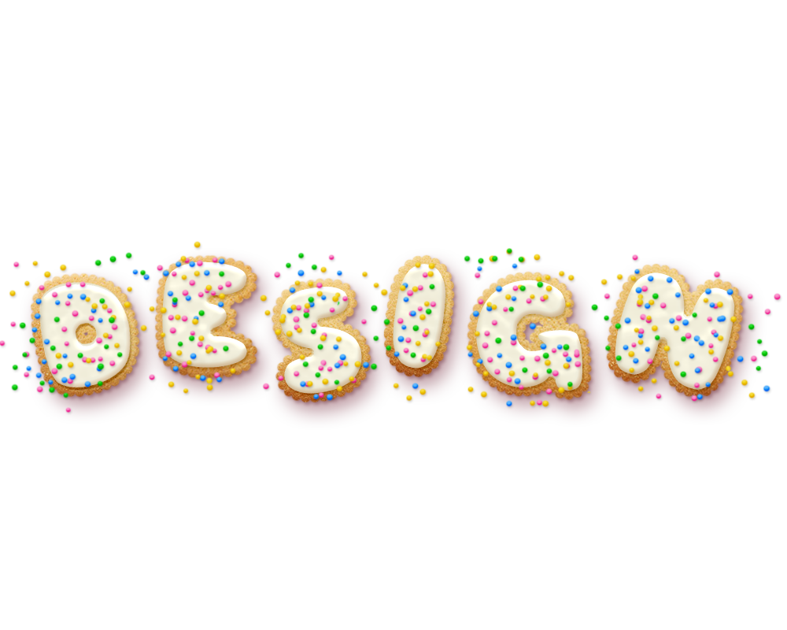

<!DOCTYPE html>
<html lang="en" dir="ltr">
  <head>
    <meta charset="utf-8">
    <meta charset="utf-8">
    <meta name="viewport" content="width=device-width, initial-scale=1, shrink-to-fit=no">
    <link rel="stylesheet" href="css/styles.css">
    <link rel="stylesheet" href="https://stackpath.bootstrapcdn.com/bootstrap/4.5.2/css/bootstrap.min.css" integrity="sha384-JcKb8q3iqJ61gNV9KGb8thSsNjpSL0n8PARn9HuZOnIxN0hoP+VmmDGMN5t9UJ0Z" crossorigin="anonymous">

    <link rel="preconnect" href="https://fonts.gstatic.com">
    <link href="https://fonts.googleapis.com/css2?family=Langar&family=Montserrat:wght@500&family=Playfair+Display:ital,wght@1,700&display=swap" rel="stylesheet">
    <title>Qianqian Tao Portfolio</title>
  </head>
  <body>
    <section id="title">
<!--Nav Bar-->
    

    <nav class="navbar navbar-expand-lg navbar-light">
      <a class="navbar-brand" href="Taoindex.html">Qianqian Tao</a>
      <button class="navbar-toggler" type="button" data-toggle="collapse" data-target="#navbarSupportedContent" aria-controls="navbarSupportedContent" aria-expanded="false" aria-label="Toggle navigation">
        
      </button>

      

        <ul class="navbar-nav ml-auto">
            <li class="nav-item">
            <a class="nav-link" href="PortfolioWork.html">Work</a>
          </li>
          <li class="nav-item">
            <a class="nav-link" href="Resume.pdf" target="_blank">Resume</a>
          </li>

          <li class="nav-item">
            <a class="nav-link" href="FinalAboutMe.html" tabindex="-1" aria-disabled="true">About Me</a>
          </li>
        </ul>
      

    </nav>

    <!-- Title -->
    

    

    <h1 class="title">Designing is my Second language.</h1>
    

    

    
    

    

  

  </section>

  <footer id="footer">
    
Copyright 2020 Qianqian Tao

    
Contact:qtao@ucsd.edu

  </footer>

  
  
  

  </body>
</html>
